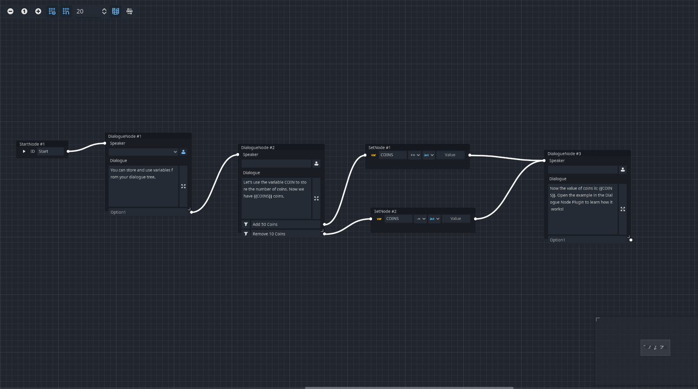
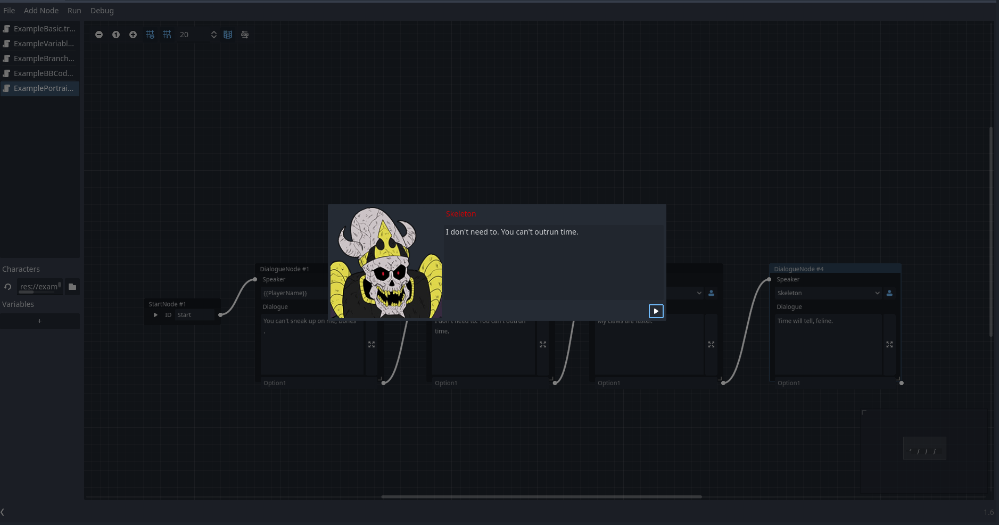
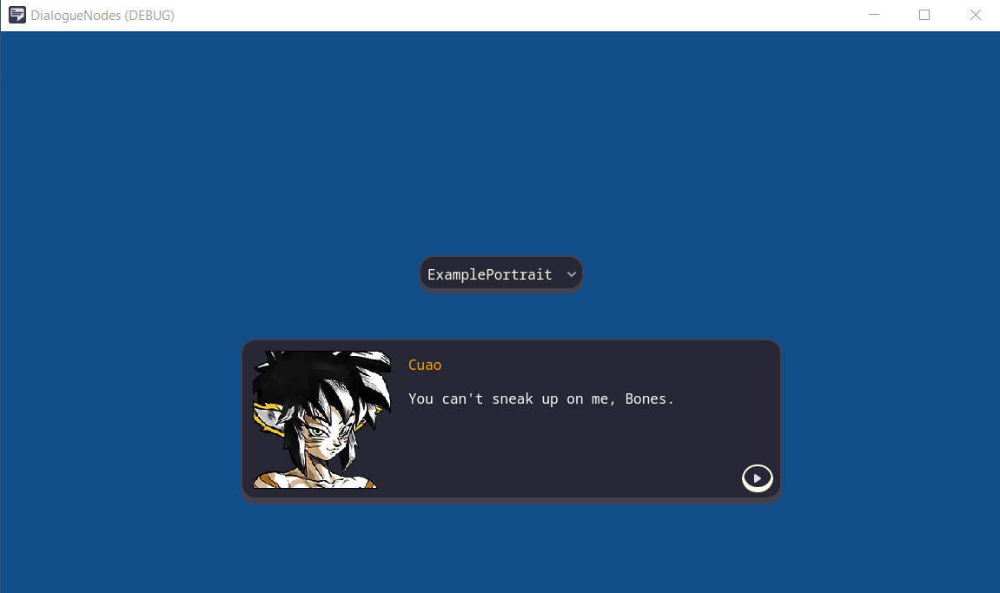

# DialogueNodes

A plugin for creating and exporting dialogue trees from within the Godot Editor.
Godot provides all the tools needed to create your own dialogue system, however, for most game developers, this task is tedious and complex. This is where Dialogue Nodes come into the picture. The plugin extends your Godot editor to allow for creating, testing and incorporating branching dialogues in your game.

#####
## Installation
The installation might be a bit tricky and you need to rely on version control to make this work... after copying and pasting the plugin into your project, Godot might complain about missing classes... that happens because Godot is attempting to load an addon that isn't compiled (we are using C#, and we need to compile the addon!). This might cause some addon scenes that contain serialized exposed fields to lose their references; that is a Godot bug which I hope gets solved soon because it's extremely annoying, so if you step into some missing classes error.. check that the addon scenes didn't lose their references.

To install the addon:
- Copy the addons/dlaogue_nodes and example folders and paste them into your project.
- This is a C# plugin and currently on 4.2.1; C# plugins have a tricky behavior, you must have created a C# solution to make this work as we need the editor to have compiled the plugin before we load it.
- In case you don't have a C# solution, go to Project > Tools > C# > Create C# Solution.
- Now you should be able to "Build a project" (Alt+B) so that the plugin compiles.
- I suggest you restart Godot at this point.
- Go to Project > Project Settings > Plugins and Enable Dialogue Nodes for C#.
- Done!

#####
## Features
### Simple and straight-forward editor
The dialogue editor was created with the focus on keeping the workflow simple and easy to pick up. While the editor supports powerful features under the hood, it tries to stay out of the way of the user. A beginner can easily pick up the editor and start creating basic dialogues thanks to the intuitive design. If your focus is on creating simple dialogues for your game, you can get setup in no time. If you want to work with multiple dialogue files, or put all the branching dialogues in one file, DialogueNodes have got you covered. Heck! Do both if you want!

### Dialogue animations, conditions, variables, signals: its all there!
The real power of the plugin lies in the tools it provides the user to utilize the full potential of the feature rich dialogue editor. Be it using variable values in the dialogue, conditional dialogues or even conditional options, modifying variable values and even emitting signals which open up a world of posibilities when it comes to custom events during the dialogue.

### Test it before you save it
The plugin allows for running any branching dialogue within the editor itself for quick testing and faster iteration times. No need to run your game every time you modify the dialogue. Under the hood, this uses the same `DialogueBox` node you'll use in your project. So, you'll know exactly how your dialogue will run in-game without even running the game!

Additionally, enable the debugging toggle to understand what all events are occuring as the dialogue runs. Note: this feature only works in the editor, not the game.

### Put a dialogue box in your game in just 2 steps
Once you have your dialogue files and are ready to test them out in-game, the plugin provides a super simple way of creating dialogue boxes for your game.

1. Add the `DialogueBox` node to your scene and set its position and size as per your requirements.
2. Select the dialogue file from the inspector and run `$DialogueBox.start('<YOUR_START_ID>')` in your code to start the dialogue.

The `DialogueBox` node provides several options to customize the look and layout to your liking. However, being derived from `Control` nodes, it is recommended to change the colors, font and borders using Godot's theme editor.

### Localize it!
The dialogue files are stored as Godot Resources, which are not only easy to edit, load and save, but also great for localizing using Godot awesome localization remap tools!

Prefer other localization methods? Stay tuned as more localization options are planned for future releases.

#####
## Known C# related issues
- .NET: Failed to unload assemblies: This bug is a [Godot-related issue](https://github.com/godotengine/godot/issues/78513) and it's a very ugly one. It seems to trigger whenever you work on an addon-related script while having the plugin enabled. In that case, Godot will not be able to unload the assemblies (probably because they are in use by the editor). This will cause the editor to be unable to compile the project and you will need to restart the editor. Be aware that, if you have any scene that makes use of an addon-related file with serialized references... those references might get lost and the plugin might break (I highly suggest using version control to recover these references after stepping into this issue, a workaround is to hardcode any reference until this bug gets fixed).
- When closing Godot you might get: "Attempt to disconnect a nonexistent connection from RichTextLabel". Although this is harmless.. this is another [Godot-related bug](https://github.com/godotengine/godot/issues/76708) caused by the [tool] keyword within C# scripts.
  
#####
## Known ORIGINAL Addon issues
- DialogueNode in the workplace may have wrong colored slots on light themes
- Using return character in the dialogue results in options not showing up in certain cases
- Shifting focus to empty option from another empty option results in the option data moving around
- DialogNodes in the graph have options overflowing outside the edges. This seems to be a bug introduced in Godot 4.2

If you find any bugs or issues, [report them in the issues page](https://github.com/germanbv/DialogueNodesForCSharp/issues). Please ensure the same or a similar issues isn't already present before creating your own.
