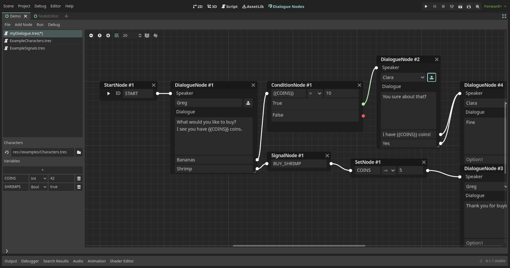
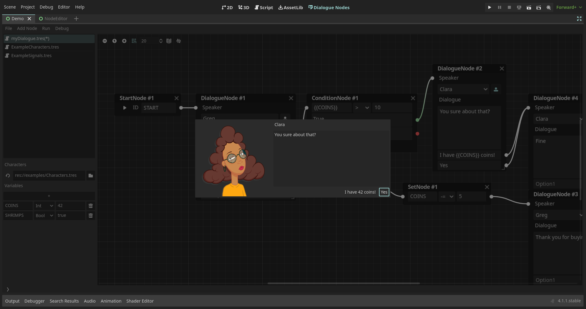
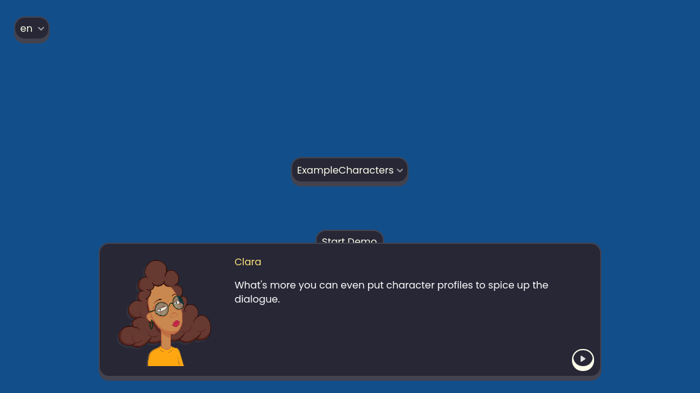

# DialogueNodes

A plugin for creating and exporting dialogue trees from within the Godot Editor.
Godot provides all the tools needed to create your own dialogue system, however, for most game developers, this task is tedious and complex. This is where Dialogue Nodes come into the picture. The plugin extends your Godot editor to allow for creating, testing and incorporating branching dialogues in your game.

#####
## Installation
- Open the `AssetLib` tab in Godot with your project open.
- Search for "DialogueNodes" and install the plugin by Nagi
- Once the download completes, deselect everything in the popup window except for the `addons` folder.
- You can also select the examples folder if you want to check out some ready-made dialogues.
- Open project settings > plugins, and enable DialogueNodes.
- Done!

For installation from the github repo, you can find the instructions in [the wiki](https://github.com/nagidev/DialogueNodes/wiki).

#####
## Features
### Simple and straight-forward editor
The dialogue editor was created with the focus on keeping the workflow simple and easy to pick up. While the editor supports powerful features under the hood, it tries to stay out of the way of the user. A beginner can easily pick up the editor and start creating basic dialogues thanks to the intuitive design. If your focus is on creating simple dialogues for your game, you can get setup in no time. If you want to work with multiple dialogue files, or put all the branching dialogues in one file, DialogueNodes have got you covered. Heck! Do both if you want!

### Dialogue animations, conditions, variables, signals: its all there!
The real power of the plugin lies in the tools it provides the user to utilize the full potential of the feature rich dialogue editor. Be it using variable values in the dialogue, conditional dialogues or even conditional options, modifying variable values and even emitting signals which open up a world of posibilities when it comes to custom events during the dialogue.

### Test it before you save it
The plugin allows for running any branching dialogue within the editor itself for quick testing and faster iteration times. No need to run your game every time you modify the dialogue. Under the hood, this uses the same `DialogueBox` node you'll use in your project. So, you'll know exactly how your dialogue will run in-game without even running the game!

Additionally, enable the debugging toggle to understand what all events are occuring as the dialogue runs. Note: this feature only works in the editor, not the game.

### Put a dialogue box in your game in just 2 steps
Once you have your dialogue files and are ready to test them out in-game, the plugin provides a super simple way of creating dialogue boxes for your game.

1. Add the `DialogueBox` node to your scene and set its position and size as per your requirements.
2. Select the dialogue file from the inspector and run `$DialogueBox.start('<YOUR_START_ID>')` in your code to start the dialogue.

The `DialogueBox` node provides several options to customize the look and layout to your liking. However, being derived from `Control` nodes, it is recommended to change the colors, font and borders using Godot's theme editor.

### Localize it!
The dialogue files are stored as Godot Resources, which are not only easy to edit, load and save, but also great for localizing using Godot awesome localization remap tools!

Prefer other localization methods? Stay tuned as more localization options are planned for future releases.

#####
## Learn more
Read [the wiki](https://github.com/nagidev/DialogueNodes/wiki) to learn how to get started with using the plugin and adding dialogues to your awesome games!

Note: The wiki is still being updated frequently. Some of the functionalities might not be documented. Please expect more updates soon, and feel free to [contact me](https://twitter.com/NagiDev) if you want to contribute to the documentation. (I could really use some help here lol!)

#####
## Known issues
- DialogueNode in the workplace may have wrong colored slots on light themes
- Using return character in the dialogue results in options not showing up in certain cases
- Shifting focus to empty option from another empty option results in the option data moving around

If you find any bugs or issues, [report them in the issues page](https://github.com/nagidev/DialogueNodes/issues). Please ensure the same or a similar issues isn't already present before creating your own.
